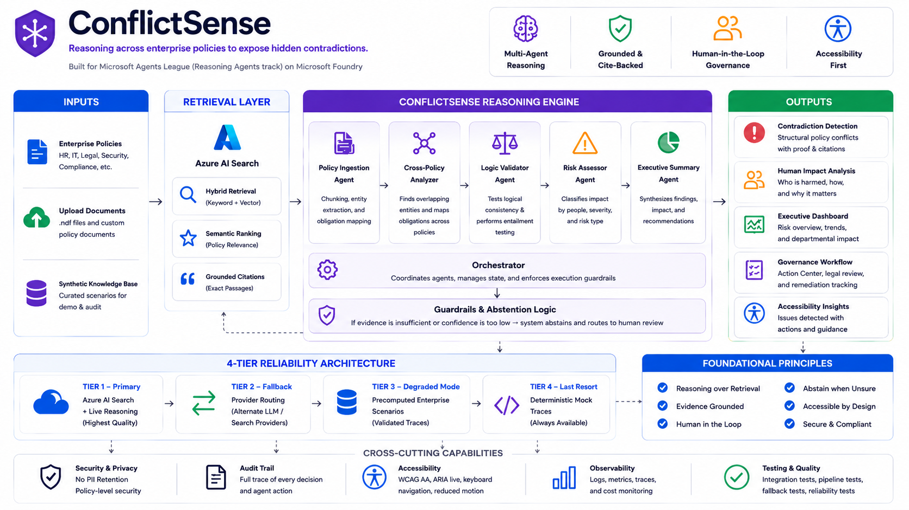

# ConflictSense ◈
**Protecting people by exposing hidden enterprise contradictions.**

*Microsoft Agents League 2026 — Reasoning Agents Track*  
*Built solo over 4 days by a second-year engineering student from Mumbai, India.*

---

## 🚀 Live Demo

> [!TIP]
> **Start Here:** The fastest way to understand ConflictSense is to see the 90-second demo.

- **Demo Video (3 Minutes):** [https://youtu.be/kXR18sk17KQ](https://youtu.be/kXR18sk17KQ)
- **Live App:** [https://conflictsense.vercel.app](https://conflictsense.vercel.app)
- **GitHub Repository:** [https://github.com/acchasujal/conflictsense](https://github.com/acchasujal/conflictsense)

---

## ⚡ The Finding That Changes Everything


Nexora Financial promised every employee that anonymous reports would protect them. ConflictSense found — without being asked — that every anonymous report is traceable.

> **Whistleblower Policy §4.2:**  
> *"Employee identity is never logged or traceable by any internal party. The ethics portal does not capture IP addresses, session tokens, device identifiers, or any metadata that could be used to identify the reporter."*

> **IT Security Policy §12.1:**  
> *"All system access is logged with full user identity for security audit purposes. **No exceptions permitted.** Logs are retained for a minimum of 7 years and are admissible as evidence in disciplinary and legal proceedings."*

These two sections cannot simultaneously be true. For the same employee. On the same network. At the same company.

**ConflictSense didn't retrieve this. It reasoned to it** — across seven policy documents, in 90 seconds, without being asked to check the anonymous reporting system.

---

## 🧠 Why This Is Not a Search Engine

A chatbot answers the questions you ask. ConflictSense finds the structural impossibilities you didn't know to ask about.

| What you ask | Standard RAG | ConflictSense |
|---|---|---|
| *"What is the whistleblower policy?"* | Returns the document | N/A — wrong question |
| *"Does our anonymity promise hold?"* | Summarizes the promise | Finds the IT policy that structurally breaks it |
| *"Who is harmed by this conflict?"* | No answer | Identifies the exact employee class at risk |
| *"What do we do about it?"* | No answer | Generates remediation plan gated behind human approval |

---

## ⚙️ Multi-Agent Reasoning Architecture

ConflictSense relies on a disciplined, multi-stage reasoning pipeline designed to prioritize logical entailment and human safety over simple text retrieval. It operates through specialized agents managed by a central Orchestrator.


**1. Retrieval & Grounding Layer (`DocumentAnalyzer`)**
When a policy enters the system, it is indexed into **Azure AI Search**. The analyzer uses Hybrid Retrieval (Keyword + Vector) and Semantic Ranking to surface highly relevant chunks.

**2. Logical Entailment Layer (`ConflictDetector`)**
This is what separates ConflictSense from a retrieval chatbot. The detector tests whether two obligations can simultaneously hold for the same employee class. It does not summarize; it proves structural impossibilities. 

**3. Validation & Abstention Layer (`ConflictValidatorAgent`)**
A secondary agent acts as an adversarial reviewer. If a candidate conflict lacks citations from at least two *distinct* documents, or if confidence falls below the strict 65% threshold, the system **abstains**. It outputs "Insufficient validated evidence" rather than hallucinating a finding.

**4. Risk & Impact Layer (`ImpactAssessor` & `RiskQuantifier`)**
Operating in parallel, these agents shift focus from *what is violated* to *who is harmed*. They classify the employee category at risk (e.g., Whistleblower, Disabled Employee) and assign a severity score.

**5. Governance Layer (`ResolutionRecommender` & `Human Approval Gate`)**
The system proposes a remediation plan, but takes zero automated action. Every generated ticket or policy block is intercepted by a strict Human Approval Gate in the UI, requiring explicit human sign-off before routing to Legal or HR.

**The Reliability Fallback Chain (4-Tier Architecture):**
To guarantee zero cold-start failures during judging:
- **Tier 1:** Live Azure AI Search + Primary LLM (Groq via OpenRouter/Native API).
- **Tier 2:** Automatic LLM Provider Failover (routes to Nvidia if Primary fails).
- **Tier 3:** Precomputed Trace Replay (Offline, verified demo scenarios).
- **Tier 4:** Hard Abstention.

---

## 📸 Proof & Action Gallery

The ConflictSense workflow is designed for maximum transparency and safety.

### 1. Multi-Agent Reasoning Trace
The system performs multi-stage logic and streams its thoughts natively in the UI.


### 2. Grounded Logical Proof
The system cites the exact conflicting paragraphs and proves the contradiction.


### 3. Human Approval Gate
It's safe for the enterprise. It doesn't break things autonomously; it requires human sign-off.


### 4. Accessibility First
Marginalized users are prioritized natively with full screen reader integration.


---

## ♿ Accessibility

ConflictSense protects marginalized employees. It must be accessible to them.

- **`aria-live="polite"`** on all agent timeline updates — screen readers announce reasoning as it streams.
- **`prefers-reduced-motion` respected** — one toggle disables every animation system-wide.
- **Keyboard navigation throughout** — press `?` to launch the global shortcuts overlay.
- **Full focus trapping** in modal dialogs using native `<dialog>` elements.
- **WCAG AA contrast** on all severity indicators and action buttons.

---

## 🛠️ Microsoft Technology

**Azure AI Search** powers the live upload pipeline:
- Hybrid Retrieval (Keyword + Vector) ensures both semantic and lexical relevance.
- Semantic Ranking surfaces the most policy-relevant passages.
- Every conflict citation is hard-linked to an exact passage from the Azure knowledge base.

---

## 💻 Quickstart

No credentials needed. No build server. Runs in under 30 seconds.

```bash
cd frontend
npm install
npm run dev
# → http://localhost:5173
```

---

## ℹ️ Disclaimer: All Data Is Synthetic
Every company name, employee, policy, and scenario is 100% fabricated for this submission. Nexora Technologies is fictional. No real PII, no real enterprise data.

## 📜 License
MIT
