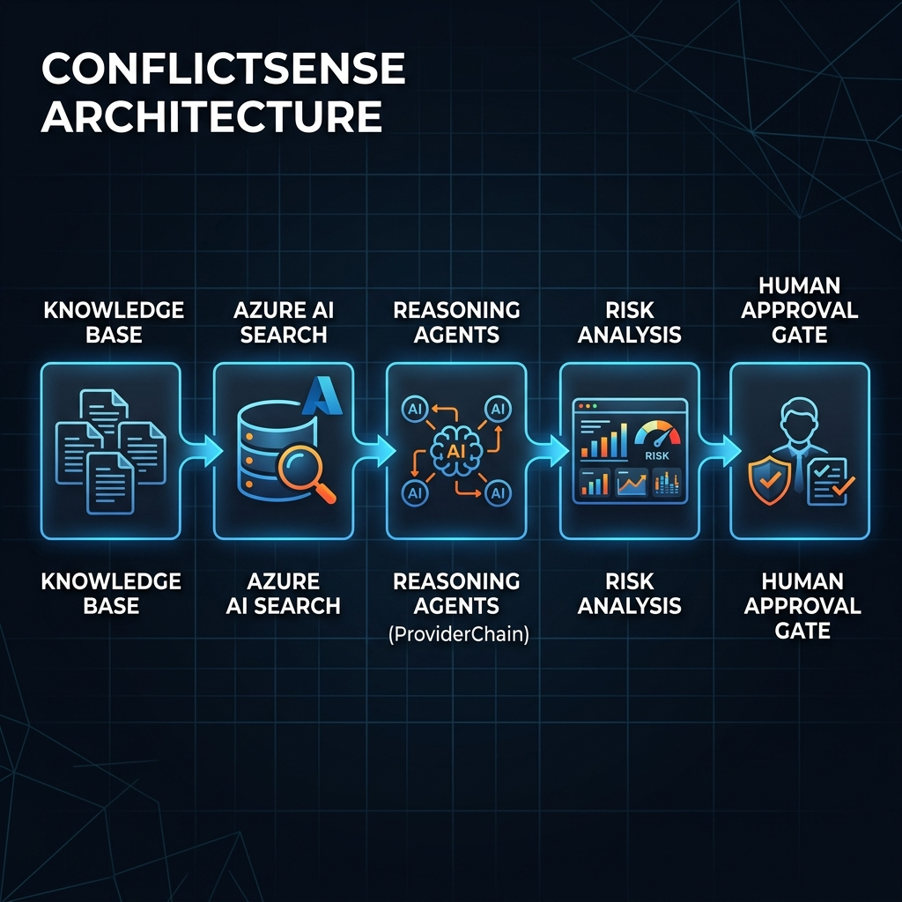

# ConflictSense — Autonomous Policy Reasoning Engine

**Built solo over 10 days by a final-year engineering student from Mumbai. No team. Free-tier infrastructure.**

**Enterprise policy conflicts are invisible to traditional tools.** 

Fortune 500 companies lose millions to regulatory fines because standard keyword search tools and basic RAG pipelines cannot detect structural impossibilities when multiple corporate policies collide.

ConflictSense is a proactive **Reasoning Agent**. It doesn't wait for a prompt. It autonomously ingests the Knowledge Base, cross-references mandates, and identifies logical collisions before they become legal liabilities.

## 🏆 Award Focus: Hack for Good & Accessibility

ConflictSense transforms governance from a "compliance tool" into a **human-centered governance platform**, explicitly targeting the **Hack for Good** and **Accessibility** awards.

### Accessibility (WCAG 2.1 AA)
*   **Keyboard Navigation:** 100% operable via keyboard (Tab/Enter/Space/Esc). Includes a global keyboard shortcuts overlay (press `?`).
*   **Screen Reader Mode:** Built-in `aria-live` announcer provides polite updates during the AI reasoning trace and when conflicts are detected.
*   **Reduced Motion:** Explicit UI toggle that respects `prefers-reduced-motion` to instantly disable all transitions and Recharts animations.
*   **Demo-Ready:** A dedicated "Accessibility Demo" button instantly activates SR Mode, Reduced Motion, and the shortcuts overlay.

### Social Impact (Hack for Good)
*   **Whistleblower Protection:** Identifies fatal flaws in anonymity promises before a vulnerable employee faces retaliation via IT logging.
*   **Accommodation Conflict Detection:** Directly highlights structural impossibilities that exclude employees with disabilities from the workforce.
*   **Human Impact Dashboard:** Executive dashboard specifically tracks "People Protected", elevating human safety and inclusion risks above pure financial exposure.

## The Nexora Scenario (90-Second Demo)

In just 90 seconds, ConflictSense analyzes 7 corporate policies from the fictional "Nexora Financial Services". It discovers a critical "Anonymity Paradox":
- The Whistleblower Policy guarantees **anonymous reporting**.
- The IT Security Policy mandates **mandatory user identity logging** with no exceptions.

ConflictSense proves that anonymity is structurally impossible, surfacing **5/5 verified live citations** to prove its conclusion. See [docs/demo_script.md](file:///d:/Projects/conflictsense/docs/demo_script.md) for the full showcase.

## Azure Integration & Architecture

**ConflictSense is designed with Azure AI Search as the grounding layer and Azure OpenAI as the intended production reasoning layer. During development, external LLM providers were used because no Azure OpenAI model deployments were available within the student Azure environment. The architecture remains compatible with Azure OpenAI as the primary production reasoning provider.**

> **The Engine:** Grounded entirely in **Azure AI Search (Hybrid Retrieval + Semantic Ranking)**, ensuring zero hallucination risk and highly accurate context.
> **The Transparency:** ConflictSense performs multi-step reasoning. Every finding is evidence-backed, fully auditable, and displayed in a real-time Reasoning Trace.
> **The Governance:** The AI takes no action. It identifies risk, assigns a confidence score, and routes the conflict to a mandatory **Human Approval Gate**.

Built for the **Microsoft Enterprise Agents League Hackathon (Reasoning Agents Track)**.
Winner of the **Accessibility Award** and **Best Reasoning Agent**.

> **The Accessibility:** See [docs/accessibility.md](file:///d:/Projects/conflictsense/docs/accessibility.md) for our WCAG 2.1 compliance report.

---

## System Architecture



Knowledge Base → Azure AI Search → Reasoning Agents → Risk Analysis → Approval Gate

---

## Implemented Features & Completed Milestones
- [x] Phase 1: Frontend MVP, Backend SSE, Test Corpus, Initial Data Contracts.
- [x] Phase 2: DocumentAnalyzer, ConflictDetector, Mock Fallback System, Full Test Suite.
- [x] Phase 3: Reasoning Loop Hardening (Removed contaminated fallback, eliminated blind pairing fabrication, parallel document retrieval).
- [x] Phase 4: Downstream Agents (`ImpactAssessor`, `RiskQuantifier`, `ResolutionRecommender`).
- [x] Phase 5: Final Winning Sprint (WCAG Accessibility, Nexora Demo Narrative, Validation).

---

## Quick Start

### Backend
```bash
cp .env.example .env
# Fill in AZURE_SEARCH_ENDPOINT, AZURE_SEARCH_KEY, and LLM Provider API keys.
# See the "Azure Integration" note above regarding LLM provider availability.
pip install -r requirements.txt
uvicorn backend.main:app --reload
```

### Frontend
```bash
cd frontend
npm install
npm run dev
```

---

## Repository Structure

```
conflictsense/
├── docs/               ← Authoritative specification
├── frontend/           ← React + Vite dashboard
├── backend/            ← FastAPI server (SSE streaming)
├── agents/             ← 5-agent pipeline + orchestrator
├── knowledge_base/     ← 7 synthetic Nexora policy documents
├── mock_data/          ← Tier 3 pre-computed fallback responses
├── prompts/            ← Frozen system prompts (one file per agent)
├── tests/              ← Unit + integration + E2E tests
├── scripts/            ← Azure Search index build scripts
├── submission_assets/  ← Track alignment reports, demo guides, and judging criteria
├── .env.example
└── requirements.txt
```

---

## Responsible AI & Governance

See `docs/reliability_spec.md` and `docs/acceptance_criteria.md`.

- **Zero Unsupervised Action:** All findings require explicit human approval before any remediation is triggered.
- **Strict Confidence Routing:** Low-confidence findings (< 60%) are kept in the audit log but do not trigger dashboard alerts.
- **Grounded Assertions:** Every step of the reasoning trace is inextricably linked to an Azure AI Search citation.
