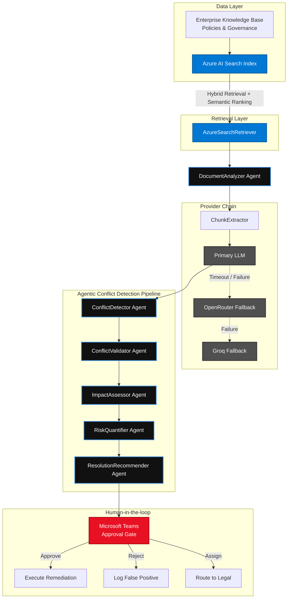

# ConflictSense Architecture

This document describes the flow of data through the ConflictSense system, leveraging Microsoft Azure services for high-reliability enterprise policy conflict detection.

## Multi-Agent Architecture powered by Azure AI Search

## Why Azure AI Search?

ConflictSense relies on **Azure AI Search** to ensure enterprise-grade reliability and avoid LLM hallucination:

1. **Hybrid Retrieval**: Combines traditional BM25 keyword matching with vector similarity search, ensuring we find both exact legal terms (e.g., "DPDP") and semantic intents (e.g., "employee privacy").
2. **Semantic Ranking**: We utilize Azure's state-of-the-art semantic ranker (powered by Microsoft's Turing models) to rerank the top results, ensuring only the most contextually relevant chunks are fed into the LLM context window. This minimizes noise and reduces token costs.
3. **Data Residency & Security**: By keeping enterprise documents indexed within Azure, we maintain strict compliance with data governance policies, a critical requirement for enterprise deployment.
