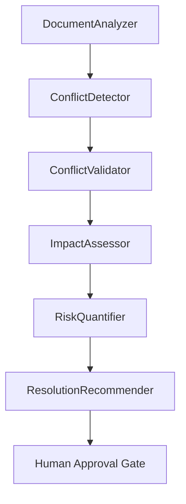
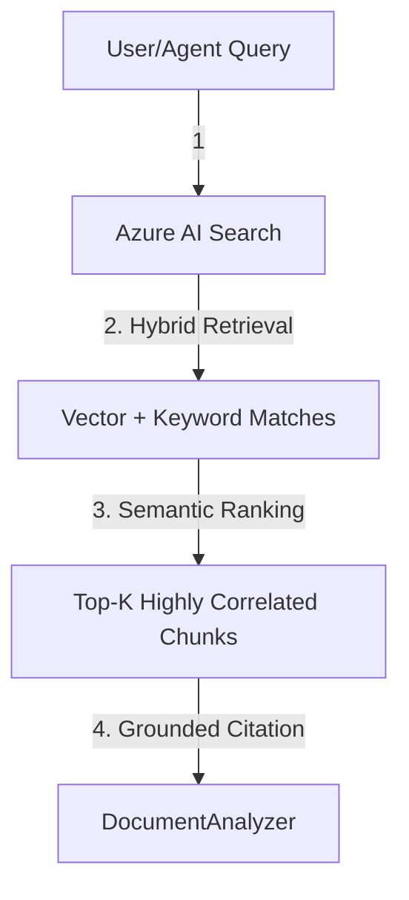
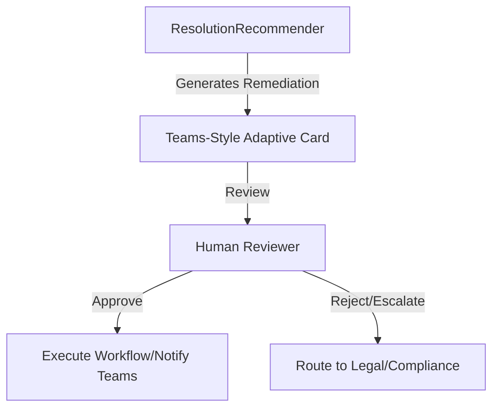

# ConflictSense Architecture

## One-line Summary
ConflictSense is a grounded policy-contradiction engine that turns siloed enterprise documents into auditable, human-reviewed conflict findings.

## What Exists Today
- `DocumentAnalyzer` retrieves grounded evidence from Azure AI Search on a per-document basis.
- `ConflictDetector` compares policy statements and identifies structural contradictions.
- `ConflictValidator` blocks weak findings that do not meet citation and confidence thresholds.
- `ImpactAssessor` estimates who and what is affected, using grounded retrieval rather than guesswork.
- The SSE UI streams the reasoning trace live so judges can see the model think step by step.
- The Approval Gate prevents autonomous action until a human explicitly approves, rejects, or escalates.

## Architecture Story for Judges
This system is deliberately not a chatbot. It is a decision-support workflow built for enterprise compliance, where the value comes from:
- grounded evidence,
- explainable reasoning,
- human control,
- and reliability under demo conditions.

## Why This Architecture Wins
- It shows multi-step reasoning, which maps directly to judging criteria.
- It avoids hallucination by requiring grounded citations from Azure AI Search.
- It is memorable because it detects a real structural impossibility, not a surface-level keyword match.
- It is enterprise-ready because every output can be audited, reviewed, and escalated.
- It is reliable because the demo includes a fallback path instead of depending on a single live model call.

## Architectural Principle
Every layer should answer one question clearly:
- `DocumentAnalyzer`: What does the source say?
- `ConflictDetector`: What contradicts what?
- `ConflictValidator`: Is this finding trustworthy enough to show?
- `ImpactAssessor`: Who is exposed?
- `SSE UI`: How do we make the reasoning visible?
- `Approval Gate`: What can a human do next?

## Submission Positioning
If a judge asks "what is innovative here?", the answer is not "we used more agents."
The answer is:
- We made policy contradictions auditable.
- We used Azure AI Search's Semantic Ranker to keep every claim grounded.
- We designed the interface around reasoning, not output dumps.
- We forced human approval into the workflow so the product is safe to trust.

## Agent Pipeline Flow

## Retrieval Flow

## Approval Flow

