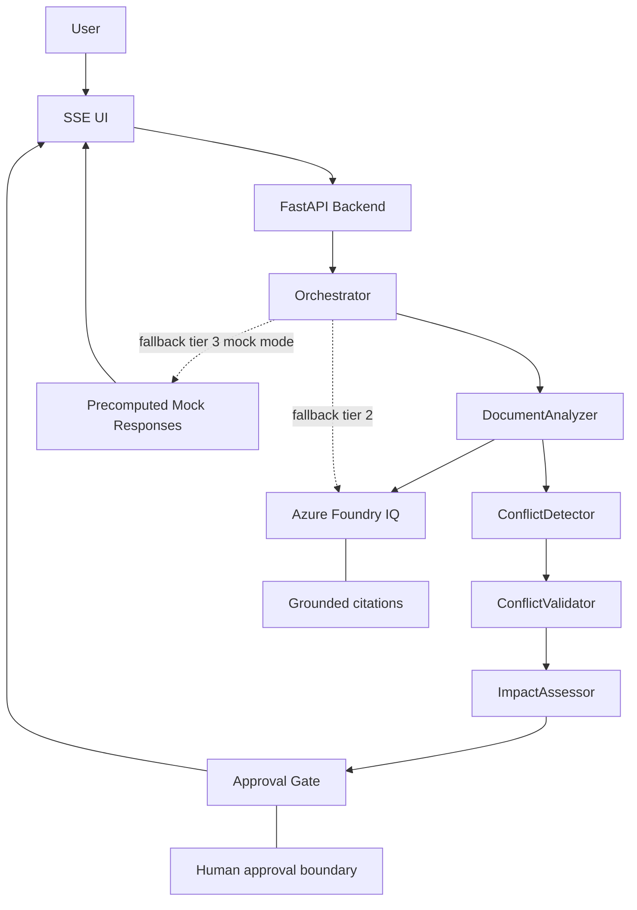

# ConflictSense Architecture Diagram

## Purpose
This diagram is designed so a judge can understand the full system in under 20 seconds.

## High-Level Flow

## Reading Order
1. User starts in the SSE UI.
2. The UI sends the request to the FastAPI backend.
3. The orchestrator executes the document reasoning pipeline.
4. Each step is grounded in Azure Foundry IQ.
5. The result passes through validation and impact assessment.
6. The Approval Gate stops autonomous action until a human decides.

## Judge Message
This is not a generic agent stack.
It is a grounded, human-reviewed enterprise conflict workflow with reliability built in.

## Why It Is Submission-Ready
- Fast to read.
- Easy to narrate.
- Shows the approved implementation only.
- Includes the fallback path and the human boundary without clutter.
- Avoids implying any extra agent responsibilities beyond the current system.
