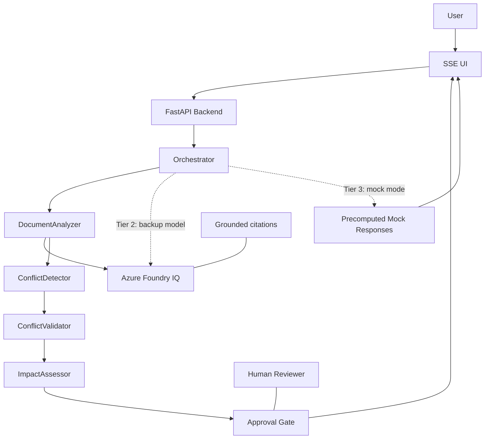

# ConflictSense Architecture Diagram Mermaid

## Notes
- The fallback path is intentionally shown as dashed edges so it reads as resilience, not as a second architecture.
- The human boundary is explicit because enterprise judges care about control, not only capability.
