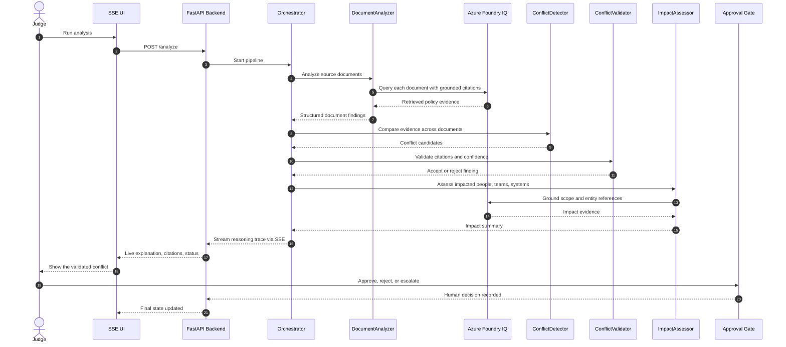

# Final Sequence Diagram

## Why This Version Is Better
- Shorter and cleaner for PDF export.
- Focuses on the approved pipeline only.
- Clearly separates evidence retrieval, validation, and human review.
- Reads well when narrated to executives.
