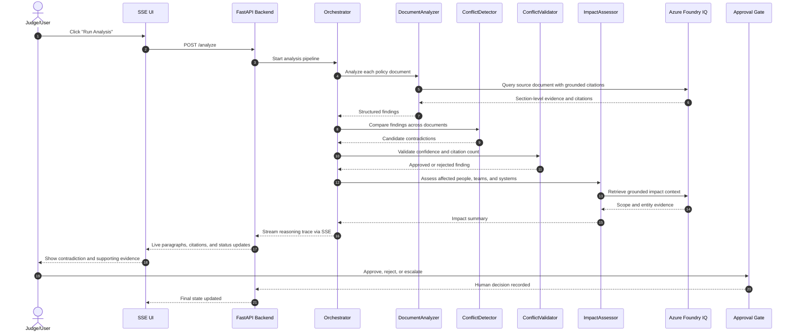

# ConflictSense Sequence Diagram

## Demo Sequence

## What This Sequence Proves
- The system does not jump straight to an answer.
- It retrieves evidence first, then reasons over it.
- It validates findings before showing them.
- It keeps a human in the loop for the last mile.

## Judge-Friendly Read
The sequence is intentionally easy to explain in under 20 seconds:
1. Load policies.
2. Ground each document with Foundry IQ.
3. Detect the contradiction.
4. Validate it.
5. Stream the reasoning trace.
6. Ask a human what to do next.
